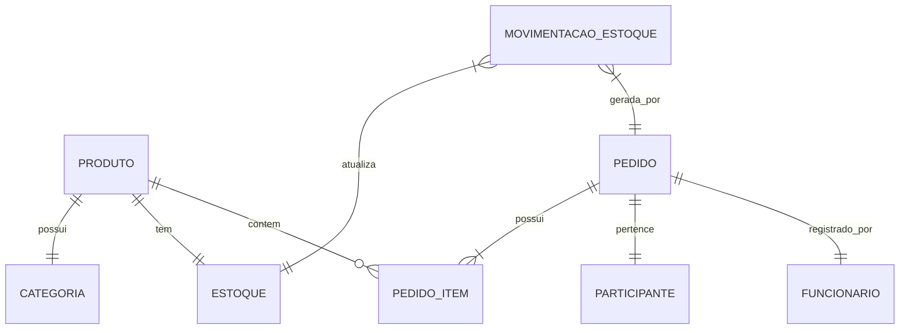

# API Gerenciamento Estoque Cerealista
API REST desenvolvida para gerenciamento de estoque de uma cerealista, permitindo controle de produtos, movimentações, funcionários e pedidos. Sistema completo com gestão de imagens e filtros avançados para todas as operações.
## 📋 Sumário
<!--ts-->
1. [Estrutura do Projeto](#%EF%B8%8F-Estrutura-do-projeto)
2. [Guia de Instalação](#-guia-de-instalação)
3. [Endpoints da API](#-endpoints-da-api)
    - [Produtos](#produtos)
    - [Estoque](#estoque)
    - [Funcionários](#funcionários)
    - [Participantes](#participantes)
    - [Pedidos](#pedidos)
    - [Estoque](#estoque)
    - [Categorias](#categorias)
    - [Upload de Imagens](#upload-de-imagens)
    - [Autenticação](#autenticação)
4. [Respostas da API](#-respostas-da-api)
5. [Documentação Técnica](#%EF%B8%8F-Documentação-Técnica)
    - [Diagrama de Relacionamentos](#Diagrama-de-Relacionamentos)
    - [Tabelas e Relacionamentos](#Tabelas-e-Relacionamentos)
    - [Regras de Deleção](#Regras-de-Deleção)
<!--te-->
## 🏗️ Estrutura do Projeto

```
src/
├── config/
│   └── dbconfig.js      # Configuração do banco de dados
│   └── uploadConfig.js       # Configuração das imagens
├── controllers/
│   ├── estoqueController.js
│   ├── funcionariosController.js
│   ├── participanteController.js
│   └── pedidosController.js
├── models/
│   ├── estoqueModel.js
│   ├── funcionariosModel.js
│   ├── participanteModel.js
│   └── pedidosModel.js
├── routes/
│   ├── estoqueRoutes.js
│   ├── funcionariosRoutes.js
│   ├── participanteRoutes.js
│   └── pedidosRoutes.js
├── scripts/
│   ├── showPasswords.js  # Exibe senhas para fins de depuração
│   └── updatePasswords.js  # Atualiza senhas caso tenha antigas sem criptografia no banco
└── uploads/
    └── produtos/      # Pasta para armazenar as imagens dos produtos
    └── funcionarios/    # Pasta para armazenar as imagens dos funcionários
```
## 🚀 Guia de Instalação

### Pré-requisitos
- [Node.js](https://nodejs.org/) (versão 14 ou superior)
- [MySQL](https://www.mysql.com/)
- npm ou yarn

### Passo a passo

1. Clone o repositório
```bash
git clone https://github.com/justino1806/API-GerenciamentoEstoque-Cerealista
```
2. Instale as dependências
```bash
npm install
```
3. Configure o banco de dados
```javascript
 // Crie um arquivo .env na raiz do projeto
DB_HOST=localhost
DB_USER=seu_usuario
DB_PASSWORD=sua_senha
DB_DATABASE=cerealista_souza
PORT=3000
```
4. Configure o diretório de uploads
 * Crie as pastas ``` uploads/produtos/ ``` e ``` uploads/funcionarios/ ``` dentro da pasta ``` src/ ```

5. Inicie o servidor
```bash
npm run dev
```
## 🔌 Endpoints da API

### Produtos
#### Listar Produtos
```http
GET /api/produtos
```
-> Parâmetros de filtro (query):

* nome
* categoria
* precoMin
* precoMax
* status

#### Adcionar Produto
```http
POST /api/produtos
```
-> Corpo da requisição:

```javascript 
{
    "nome": "Arroz Branco",
    "preco_produto": 15.90,
    "descricao": "Arroz 1kg",
    "imagem_produto": null, 
    "id_categoria": 1,   // Dependencia com a tabela categoria
    "id_participante": 1 // Dependencia com a tabela participante
}
```
#### Atualizar Produto
```http
PUT /api/produtos/:id
```
-> Corpo da requisição:
```json
{
    "nome": "Novo Nome",
    "preco_produto": 25.90
}
```
#### Deletar Produto
```http
DELETE /api/produtos/:id 
```
caso dê erro , tente utilizar da seguinte forma: ```/api/produtos{id}```
### Movimentações
#### Listar Movimentações
```http
GET /api/estoque/movimentacao
```
-> Parâmetros de filtro (query):
* dataInicio
* dataFim
* tipoMovimentacao
* nomeProduto
* nomeParticipante
* valorMin
* valorMax
#### Listar Produtos em Estoque
```http
GET /api/estoque/produtos
```
-> Parâmetros de filtro (query):
* nome
* categoria
* precoMin
* precoMax
* status
### Funcionários
#### Listar Funcionários
```http
GET /api/funcionarios
```
#### Adcionar Funcionário
```http
POST /api/funcionarios
```
-> Corpo da requisição:
```json
{
    "nome_funcionario": "João Silva",
    "cpf": "12345678901",
    "data_admissao": "2023-01-01",
    "rua": "Rua Teste",
    "numero": 123,
    "bairro": "Centro",
    "cidade": "São Paulo",
    "estado": "SP",
    "cep": "12345678",
    "senha": "123456",
    "telefone_funcionario": "11999999999",
    "nivel_acesso": 2,
    "cargo": "Vendedor"
}
```
#### Atualizar Funcionário
```http
PUT /api/funcionarios/:id
```
#### Deletar Funcionário
```http
DELETE /api/funcionarios/:id
```
### Participantes
#### Listar Participantes
```http
GET /api/participantes
```
#### Parâmetros de filtro (query):
* nome
* cpf
* cnpj
* estado
* cidade
#### Adcionar Participante
```http
POST /api/participantes
```
-> Corpo da requisição:
```json
{
    "nome_participante": "Empresa XYZ",
    "telefone_participante": "11999999999",
    "rua": "Rua Comercial",
    "numero": 100,
    "bairro": "Centro",
    "cidade": "São Paulo",
    "estado": "SP",
    "cep": "12345678",
    "cnpj": "12345678901234",
    "cpf": "12345678901"
}
```
#### Atualizar Participante
```http
PUT /api/participantes/:id
```
#### Deletar Participante
```http
DELETE /api/participantes/:id
```
### Pedidos
#### Criar Pedidos
```http
POST /api/pedidos
```
-> Corpo da requisição:
```javascript
{
    "id_tipo_movimentacao": "E", // "E" para entrada e "S" para saida
    "id_participante": 1, //Dependencia com a tabela participante
    "id_funcionario": 1,  //Dependencia com a tabela funcionario
    "itens": [
        {
            "item": 1, 
            "id_produto": 1, //Dependencia com a tabela produto
            "quantidade": 10,
            "valor_unitario": 15.90
        }
    ]
}

```
#### Listar Pedidos
```http
GET /api/pedidos
```
#### Parâmetros de filtro (query):
* dataInicio
* dataFim
* tipoMovimentacao
* nomeProduto
* nomeParticipante
* valorMin
* valorMax
### Categorias
#### Listar Categorias
```http
GET /api/Categorias
```
#### Adcionar Categoria
```http
POST /api/categorias
```
-> Corpo da requisição:
```json
{
    "nome_categoria": "Grãos"
}
```
#### Atualizar Categoria
```http
PUT /api/categorias/:id
```
#### Deletar Categoria
```http
DELETE /api/categorias
```
### Upload de Imagens

#### Produtos
- Rota: POST /api/produtos
- Campo: imagem_produto
- Formatos aceitos: .jpg, .jpeg, .png
- Tamanho máximo: 5MB
- Local de armazenamento: src/uploads/produtos/

#### Funcionários
- Rota: POST /api/funcionarios
- Campo: imagem_funcionario
- Formatos aceitos: .jpg, .jpeg, .png
- Tamanho máximo: 5MB
- Local de armazenamento: src/uploads/funcionarios/

As imagens são retornadas nas consultas como URLs relativas, exemplo:
```json
{
    "id_produto": 1,
    "nome": "Arroz Branco",
    "imagem_produto": "uploads/produtos/123456-7890123.jpg"
}
```
### Exemplos de Requisições
Para enviar imagens, use `multipart/form-data`:

1. No Postman:
- Selecione POST
- Vá em "Body"
- Selecione "form-data"
- Adicione os campos normais como text
- Para a imagem, selecione "File" no dropdown do campo

2. Com Axios:
```javascript
const formData = new FormData();
formData.append('nome', 'Arroz Branco');
formData.append('preco_produto', '15.90');
formData.append('imagem_produto', arquivo);

axios.post('/api/produtos', formData, {
    headers: {
        'Content-Type': 'multipart/form-data'
    }
});
```
### Autenticação
#### Login
```http
POST /api/auth/login
```
-> Corpo da requisição:
```json
{
    "email": "funcionario@email.com",
    "senha": "123456"
}
```
##### Resposta:
```javascript
{
    "token": "eyJhbGciOiJIUzI1...", // Token JWT
    "funcionario": {
        "id": 1,
        "nome": "Nome Funcionario",
        "nivel_acesso": 1
    }
}
```
#### Logout
```http
POST /api/auth/logout
```
##### Header necessário:
```javascript
Authorization: Bearer [token-do-usuario]
```
### Níveis de Acesso
- 1: Administrador (necessário para gerenciar funcionários)
- 2: Vendedor (necessário para usar as demais funções)
### Autenticação de Rotas
##### Todas as rotas (exceto o login) requetem o token no header
```header
Authorization: Bearer [token-do-usuario]
```
## 🔄 Respostas da API

### Status Codes
- 200: Sucesso
- 201: Criado com sucesso
- 400: Erro na requisição
- 404: Não encontrado
- 500: Erro interno

### Exemplos de Respostas

#### Requisitação com Postman
```javascript
// GET /api/produtos
{
    "id_produto": 1,
    "nome": "Arroz Branco",
    "preco_produto": 15.90,
    "descricao": "Arroz 1kg",
    "imagem_produto": "uploads/produtos/123456.jpg",
    "categoria": "Grãos"
}
```
#### Requisitação com Axios
```javascript
// GET
axios.get('/api/produtos')
  .then(response => console.log(response.data));

// POST
axios.post('/api/produtos', {
    nome: "Arroz Branco",
    preco_produto: 15.90
});
```
#### Requisitação com Fetch
```javascript
// GET
fetch('/api/produtos')
  .then(response => response.json())
  .then(data => console.log(data));

// POST
fetch('/api/produtos', {
    method: 'POST',
    headers: {
        'Content-Type': 'application/json'
    },
    body: JSON.stringify({
        nome: "Arroz Branco",
        preco_produto: 15.90
    })
});
```
## 🗄️ Documentação Técnica

### Estrutura do Banco de Dados

#### Diagrama de Relacionamentos



#### Tabelas e Relacionamentos
1. Produto
   - Pertence a uma Categoria
   - Possui um registro em Estoque
   - Referenciado em Pedido_Item

2. Pedido
   - Possui múltiplos Pedido_Item
   - Vinculado a um Participante
   - Vinculado a um Funcionário
   - Gera Movimentações no Estoque

3. Movimentação
   - Vinculada a um Produto
   - Vinculada a um Pedido
   - Atualiza Estoque

#### Regras de Deleção
1. Produto: Requer deleção de:
   - Movimentações
   - Pedido_Item
   - Estoque

2. Funcionário: Requer deleção de:
   - Pedidos
   - Movimentações relacionadas

3. Participante: Requer deleção de:
   - Pedidos
   - Movimentações relacionadas
